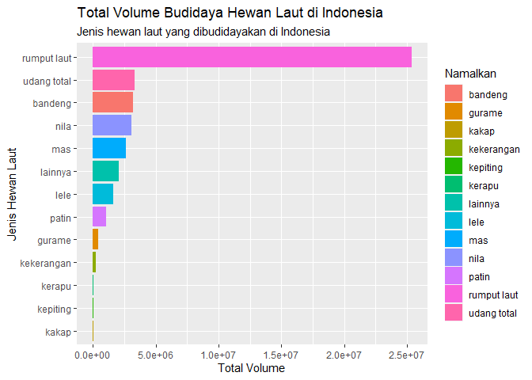

Pembudidayaan Ikan Nasional
================
Rifaldi
2022-07-02

## Import library

``` r
library(dplyr)
```

    ## 
    ## Attaching package: 'dplyr'

    ## The following objects are masked from 'package:stats':
    ## 
    ##     filter, lag

    ## The following objects are masked from 'package:base':
    ## 
    ##     intersect, setdiff, setequal, union

``` r
library(ggplot2)
```

## Read data csv

``` r
df <- read.csv("D:/Tugas/Semester 8/produksibudidayanasional.csv")
str(df)
```

    ## 'data.frame':    4620 obs. of  9 variables:
    ##  $ ID          : int  1 2 3 4 5 6 7 8 9 10 ...
    ##  $ ProvinsiID  : int  11 12 13 14 15 16 17 18 19 21 ...
    ##  $ NamaProvinsi: chr  "Aceh" "Sumatera Utara" "Sumatera Barat" "Riau" ...
    ##  $ Budidaya    : chr  "semua budidaya" "semua budidaya" "semua budidaya" "semua budidaya" ...
    ##  $ NamaIkan    : chr  "total" "total" "total" "total" ...
    ##  $ Tahun       : int  2003 2003 2003 2003 2003 2003 2003 2003 2003 2003 ...
    ##  $ Volume      : int  33877 44187 30690 36393 9358 42504 8141 55150 776 0 ...
    ##  $ Nilai       : num  6.30e+08 1.11e+09 2.55e+08 1.15e+09 1.15e+08 ...
    ##  $ IkanID      : int  0 0 0 0 0 0 0 0 0 0 ...

## Selecting, Filtering and Aggregate data

``` r
data_volume <- df %>% 
  select(-c(ID, ProvinsiID, Budidaya, IkanID, Nilai)) %>% 
  filter(NamaIkan != "total", Volume > 0) %>% 
  group_by(NamaIkan) %>% 
  summarise(total_volume=sum(Volume))
```

## Data Visualization

``` r
ggplot(data_volume, aes(x= reorder(NamaIkan,total_volume), y=total_volume, fill=NamaIkan)) +
  geom_bar(stat = "identity") +
  coord_flip() +
  labs(
    title = "Total Volume Budidaya Hewan Laut di Indonesia",
    subtitle = "Jenis hewan laut yang dibudidayakan di Indonesia",
    x = "Jenis Hewan Laut",
    y = "Total Volume")
```

<!-- -->
